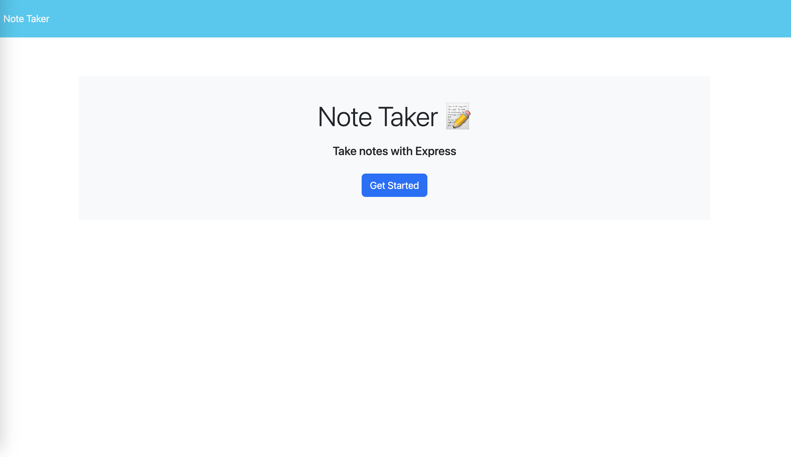
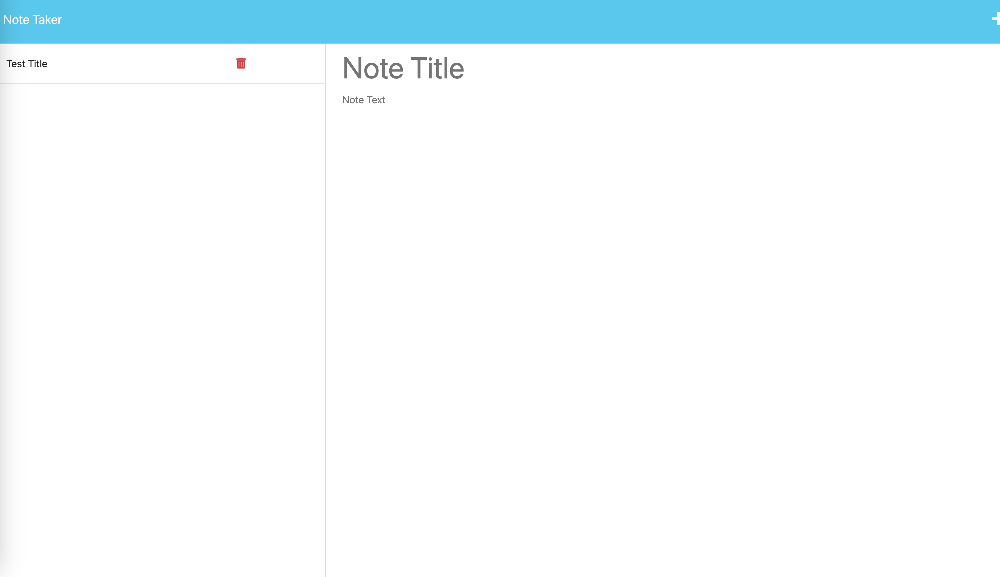
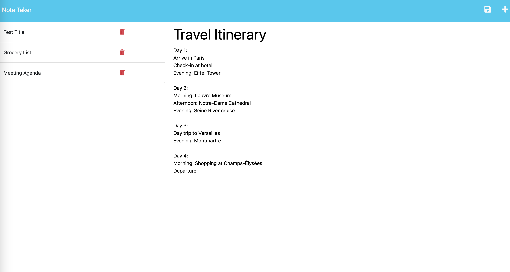
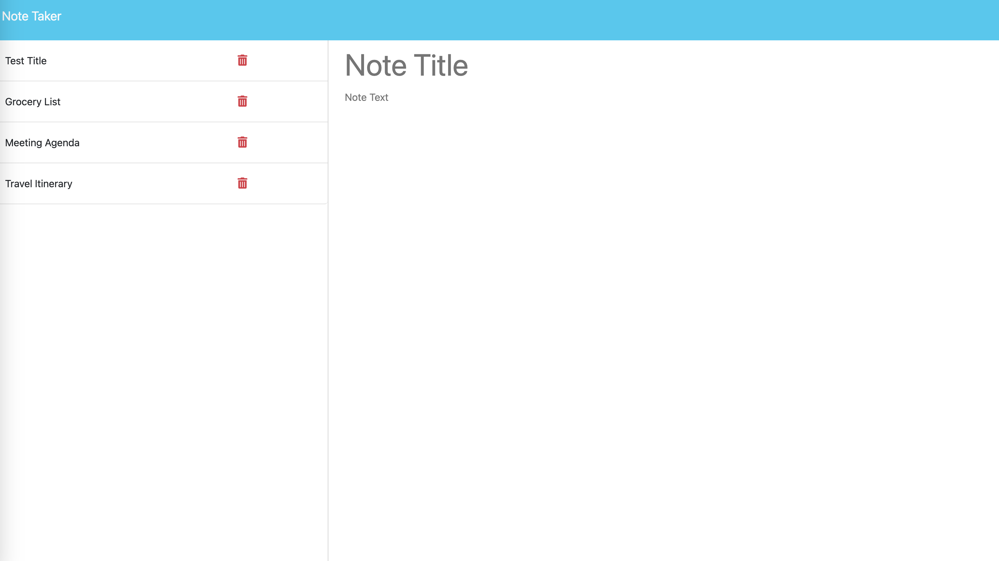

# Note Taking Ch11

This project uses the following technologies:

- HTML (markup language)
- CSS (styling)
- JavaScript (front end functionality)
- Node.js (runtime environment)
- Express.js (back end framework)
- JSON (data storage)
- Heroku (deployment)

## Description

The note-taker web app allows users to create, save, and manage notes and tasks. With the front end finished, the next steps are to build an Express.js back end, connect it to the front end, and deploy the app to Heroku using JSON for data storage.

## Table of Contents

- [Installation](#installation)
- [Usage](#usage)
- [Credits](#credits)
- [Tests](#tests)

## Installation

Follow these steps to set up the note-taker web app on your local machine:

1.  Clone the repository to your local machine.

    `"git clone git@github.com:etapm/Note_Taking-ch11.git"`

2.  Navigate to the root directory of the project.

    `"cd Note_Taking-ch11"`

3.  Install the dependencies.

    `"npm install"`

4.  Configure environment variables. Create a .env file in the root directory and add any required environment variables, such as the PORT number for the application to listen on.

    `"Example: PORT=3000"`

5.  Start the server.

    `"npm start"`

6.  Open the app in your browser.

    `"http://localhost:3000"`

    7.(optional) Deploy the app to Heroku. Follow the official [Heroku](https://devcenter.heroku.com/articles/getting-started-with-nodejs) documentation to create an account, install the Heroku CLI, and deploy the app.

- Review the code on the GitHub repository by visiting the [GitHub Repository](https://https://github.com/etapm/Note_Taking-ch11).

## Usage

1.  Access the app: Open the app in your browser. Use http://localhost:3000 for local or the [Heroku URL](https://note-taking-ch11.herokuapp.com/) for deployed version.

    

2.  Create a note: Click "+" to start a new note. Enter the title and content.

    

3.  Save the note: Click "Save" to store the note in the JSON file on the server.

    

4.  View notes: Click a note title from the list on the left to see its content.

    

5.  Delete a note: Click the trash icon next to a note title to remove it from the JSON file.

## Credits

N/A

## License

N/A

## Badges

N/A

## Features

N/A

## How to Contribute

N/A

## Tests
